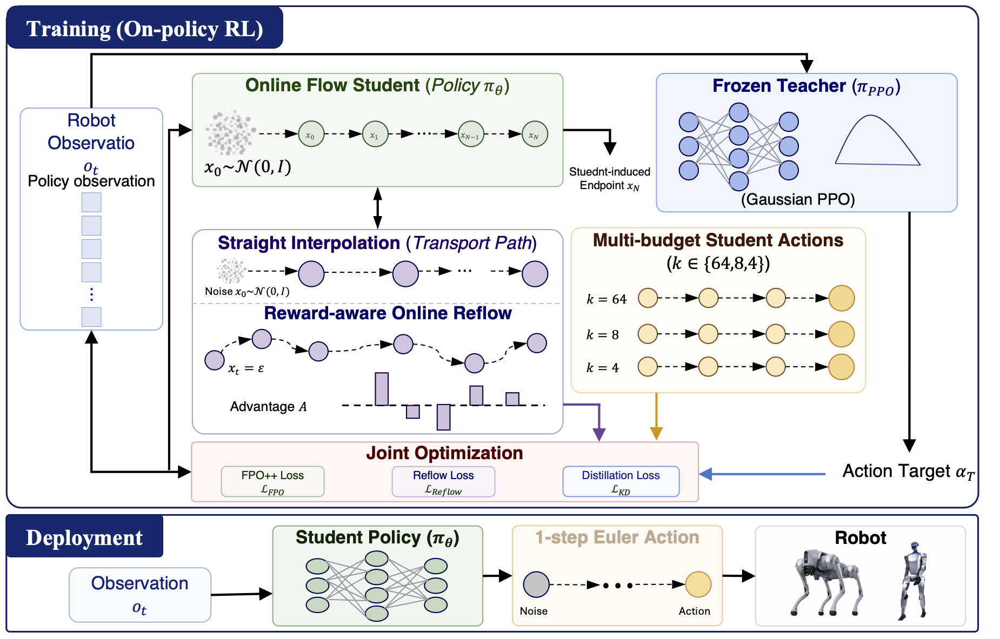

# RFPO: Rectified Flow Policy Optimization for Embodied Control

This is the official repository for the paper:
> **RFPO: Rectified Flow Policy Optimization for Embodied Control**
>
> [Ting Huang](https://github.com/Believeht029)\*<sup>1</sup>, [Lisiyu Pan](https://github.com/yuyuyu-maker)\*<sup>1</sup>, [Haoyu Wang](https://github.com/whyyyyy123)\*<sup>1</sup>, [Zeyu Zhang](https://steve-zeyu-zhang.github.io/)\*<sup>†</sup><sup>1</sup>, [Siyuan Qian](https://github.com/SiriYep)<sup>1</sup>, [Yanjun Li](https://github.com/yanjun711)<sup>1</sup>, [Yandong Guo](https://scholar.google.com/citations?user=fWDoWsQAAAAJ&hl=en)<sup>2</sup>, [Boxin Shi](https://scholar.google.com/citations?user=K1LjZxcAAAAJ&hl=en)<sup>1</sup>, and [Hao Tang](https://ha0tang.github.io/)<sup>#</sup><sup>1</sup>
>
> <sup>1</sup>School of Computer Science, Peking University 
> <sup>2</sup>AI<sup>2</sup> Robotics
>
> \*Equal contribution. <sup>†</sup>Project lead. <sup>#</sup>Corresponding author.
>
> [**Paper**](https://arxiv.org/abs/2610.10453) · [**Project page**](https://aigeeksgroup.github.io/RFPO/) · [**Code**](https://github.com/AIGeeksGroup/RFPO) · [**Model**](https://huggingface.co/AIGeeksGroup/RFPO)


## 🎥 RFPO

<video src="asset/RFPO.mp4" autoplay loop muted playsinline controls preload="auto" width="100%">
  Your browser does not support embedded video. [Download RFPO.mp4](asset/RFPO.mp4).
</video>

## ✏️ Citation

If this code or paper is useful, please cite:

```bibtex
@article{huang2026rfpo,
  title   = {RFPO: Rectified Flow Policy Optimization for Embodied Control},
  author  = {Huang, Ting and Pan, Lisiyu and Wang, Haoyu and Zhang, Zeyu
             and Qian, Siyuan and Li, Yanjun and Guo, Yandong and Shi, Boxin
             and Tang, Hao},
  journal = {arXiv preprint arXiv:2610.10453},
  year    = {2026}
}
```

## 🏃 Intro RFPO

Flow policies are expressive for continuous control, but their action generation normally requires iterative ODE integration. A policy optimized with 64 Euler steps can fail when the same policy is executed with one step. We call this mismatch the **few-step discretization gap**.

RFPO addresses the gap during on-policy optimization. Reward-aware online Reflow rectifies student-induced transport paths, while a frozen Gaussian PPO controller provides action-space supervision at multiple solver budgets. The deployed controller is still a single flow student executed with one Euler step; the PPO teacher and auxiliary training branches are removed before deployment.

## 🧭 RFPO pipeline



During training, the robot observation is passed to an online flow student and a frozen Gaussian PPO teacher. The student produces a full-budget endpoint and uses it to construct a student-induced transport path. Positive-advantage samples receive more weight in reward-aware Reflow. The same student is evaluated at 64, 8, and 4 Euler steps and distilled toward the teacher action.

## 📰 News

- **2026/10/07:** RFPO paper submitted to arXiv as [arXiv:2610.10453](https://arxiv.org/abs/2610.10453).

## 📊 Results

The paper evaluates Unitree Go2, Boston Dynamics Spot, Unitree H1, and Unitree G1. Values are average episodic rewards; reward scales are task-specific and should be compared within each embodiment.

| Robot | Method | Zero, 64-step | Zero, 1-step | Random, 64-step | Random, 1-step |
| --- | --- | ---: | ---: | ---: | ---: |
| Unitree Go2 | FPO++ | 21.29 | -187.70 | 17.66 | -220.10 |
|  | RFPO | **34.78** | **34.25** | **31.56** | **31.50** |
| Boston Dynamics Spot | FPO++ | 9.29 | -404.05 | 9.31 | -195.82 |
|  | RFPO | **28.41** | **28.52** | **24.41** | **24.98** |
| Unitree H1 | FPO++ | 376.67 | 18.88 | 325.16 | 22.70 |
|  | RFPO | **417.50** | **413.78** | **404.42** | **406.36** |
| Unitree G1 | FPO++ | 18.28 | -1.51 | 4.00 | -2.82 |
|  | RFPO | **54.30** | **55.24** | **52.35** | **52.03** |

Key findings:

- One-step returns remain within **2.4%** of the corresponding 64-step returns across all four embodiments and both initialization modes.
- Unitree Go2 retains **98.5%** of its 64-step reward with one-step execution.
- Go2 mean onboard inference latency decreases from **4.39 ms** to **0.08 ms**, a **54.9×** speedup. The p99 latency decreases from 20.06 ms to 0.10 ms.
- Matched-command Go2 sim-to-real joint-position correlation is 0.992–0.997 for forward, lateral, and yaw commands.

## 🧰 Supported environments

| Family | Isaac Lab task | Notes |
| --- | --- | --- |
| Unitree Go2 | `Isaac-Velocity-Flat-Unitree-Go2-v0` | Main quadruped benchmark |
| Boston Dynamics Spot | `Isaac-Velocity-Flat-Spot-v0` | Quadruped benchmark |
| Unitree H1 | `Isaac-Velocity-Flat-H1-v0` | Humanoid velocity control |
| Unitree G1 | `Isaac-Velocity-Flat-G1-v0` | Humanoid velocity control |
| Unitree G1 | `Tracking-Flat-G1-v0` | Whole-body motion tracking |
| Cartpole | `Isaac-Cartpole-Direct-v0` | Lightweight debugging task |

The detailed Isaac Lab experiment notes are available in [`isaaclab_experiments/README.md`](isaaclab_experiments/README.md).

## ⚙️ Environment Setup

### Requirements

- Linux
- NVIDIA GPU with a CUDA 12.1-compatible driver
- Conda
- Isaac Sim 4.5.0

Initialize the submodules and create the `isaaclab_fpo` environment:

```bash
git submodule update --init --recursive
cd isaaclab_experiments
bash setup_env.sh
source source_env.sh
```

The setup script installs Isaac Lab, the local `isaaclab_fpo` package, whole-body tracking, robot assets, and LAFAN1 motion data. By default, Conda is installed under `/tmp/isaaclab_conda`; set `CONDA_ROOT` before setup when another executable filesystem is required.

## 🚀 Training

Run all commands from `isaaclab_experiments` after sourcing the environment. The main entry point is `isaaclab_fpo/scripts/train.py`.

### FPO++ baseline

```bash
python isaaclab_fpo/scripts/train.py \
  --task Isaac-Velocity-Flat-Unitree-Go2-v0 \
  --headless
```

Change `--task` to train Spot, H1, or G1. Common options are `--num_envs`, `--max_iterations`, `--seed`, `--logger wandb`, and positional `agent.*` or `env.*` overrides.

### RFPO with a frozen PPO teacher

The complete RFPO configuration is `all_ideas_teacher_kd`. It requires a Gaussian PPO checkpoint compatible with the selected task:

```bash
python isaaclab_fpo/scripts/train.py \
  --task Isaac-Velocity-Flat-Unitree-Go2-v0 \
  --headless \
  --fpo_variant all_ideas_teacher_kd \
  --teacher_checkpoint /path/to/gaussian_ppo_teacher.pt
```

The launchers below configure GPU selection, environment count, logging, checkpoint synchronization, and post-training evaluation:

```bash
# Go2
PPO_TEACHER=/path/to/gaussian_ppo_teacher.pt \
  bash scripts/run_go2_all_ideas_teacher_kd.sh

# G1
TEACHER=/path/to/gaussian_ppo_teacher.pt \
  bash scripts/run_g1_all_ideas_teacher_kd.sh
```

### FPO variants

Variants are registered per robot in [`task_cfgs.py`](isaaclab_experiments/isaaclab_fpo/isaaclab_fpo/task_cfgs.py):

| Variant | Training signal |
| --- | --- |
| `baseline` | Original FPO++ on-policy objective |
| `reflow` | Student-induced Reflow loss |
| `reward_aware` | Advantage-weighted Reflow rectification |
| `adaptive_compute` | State-adaptive solver-budget regularization |
| `reflow_random_x0` | Random/zero initialization and few-step consistency |
| `reflow_teacher_kd` | Reflow plus frozen PPO multi-budget action distillation |
| `all_ideas_teacher_kd` | RFPO: reward-aware Reflow, PPO-KD, adaptive compute, and theory metrics |

`fpo_operator`, `theory`, `all_ideas`, and `all_ideas_fpo` are additional research configurations where registered. Use `python isaaclab_fpo/scripts/train.py --help` and the task registry to check availability for a specific robot.

## 🧪 Evaluation

Evaluate a checkpoint across Euler budgets with zero-noise and random-noise initialization:

```bash
python -u isaaclab_fpo/scripts/eval_sampling_steps.py \
  --task Isaac-Velocity-Flat-Unitree-Go2-v0 \
  --headless \
  --disable_fabric \
  --num_envs 2048 \
  --eval_episodes 10 \
  --sampling_steps 64 32 16 8 4 1 \
  --eval_modes zero random \
  --fpo_variant all_ideas_teacher_kd \
  --model rfpo=/path/to/model_2499.pt
```

The `--fpo_variant` must match the checkpoint configuration. The command prints a summary table for each sampling budget. Multi-checkpoint examples are available in `scripts/eval_sampling_steps_sweep.sh`, `scripts/eval_reflow_2500_final.sh`, and `scripts/eval_spot_standalone.sh`.

## 🎬 Playback and visualization

Use Isaac Sim playback to inspect a checkpoint and export JIT/ONNX policies:

```bash
python isaaclab_fpo/scripts/play.py \
  --task Isaac-Velocity-Flat-Unitree-Go2-v0 \
  --checkpoint /path/to/model_2499.pt \
  --headless \
  --num_envs 1
```

For browser playback with Viser, run the deployed one-step student:

```bash
python isaaclab_fpo/scripts/play_with_viser.py \
  --task Isaac-Velocity-Flat-Unitree-Go2-v0 \
  --checkpoint /path/to/model_2499.pt \
  --headless \
  --viser \
  --flow-sampling-steps 1 \
  --num_envs 1
```

Open <http://localhost:8080> after the Viser server starts. The script also accepts a W&B run path and checkpoint name.

## 🗂️ Repository layout

```text
.
├── asset/
│   ├── pipeline.png                           # RFPO training/deployment overview
│   ├── g1_sim2real_sync.mp4                   # Synchronized G1 sim-to-real demo
│   └── go2_sim2real_sync.mp4                  # Synchronized Go2 sim-to-real demo
├── isaaclab_experiments/
│   ├── README.md                              # Isaac Lab experiment notes
│   ├── setup_env.sh                           # One-time environment setup
│   ├── source_env.sh                          # Activate isaaclab_fpo
│   ├── scripts/                               # Training, evaluation, and launcher scripts
│   ├── isaaclab_fpo/
│   │   ├── scripts/train.py                   # Main training entry point
│   │   ├── scripts/eval_sampling_steps.py     # Few-step evaluation
│   │   ├── scripts/play.py                    # Isaac Sim playback/export
│   │   ├── scripts/play_with_viser.py         # Browser playback
│   │   └── isaaclab_fpo/
│   │       ├── algorithms/fpo.py              # FPO++ and RFPO losses
│   │       ├── modules/actor_critic.py        # Flow actor and value critic
│   │       ├── task_cfgs.py                   # Task and variant registry
│   │       ├── rl_cfg.py                      # Configuration dataclasses
│   │       └── runners/on_policy_runner.py    # On-policy training loop
│   ├── thirdparty/                            # Isaac Lab and tracking submodules
│   └── whole_body_tracking_reference_data/    # Generated LAFAN1 motion data
└── README.md
```

## 🤖 Sim-to-Real Demonstrations

Each demo below is a pre-composed side-by-side video. Simulation and real-robot frames share one timeline and one player, so playback remains synchronized in the README.

### Unitree G1

<video src="asset/g1_sim2real_sync.mp4" autoplay loop muted playsinline controls preload="auto" width="100%">
  Your browser does not support embedded video. [Download the synchronized G1 demo](asset/g1_sim2real_sync.mp4).
</video>

Source clips: [simulation](asset/g1_sim_foward_backward.mp4) · [real robot](asset/g1_real_forward_backward.mp4)

### Unitree Go2

<video src="asset/go2_sim2real_sync.mp4" autoplay loop muted playsinline controls preload="auto" width="100%">
  Your browser does not support embedded video. [Download the synchronized Go2 demo](asset/go2_sim2real_sync.mp4).
</video>

Source clips: [simulation](asset/go2_sim_forward.mp4) · [real robot](asset/go2_real_forward.mp4)

## 😘 Acknowledgement

We thank the authors of [Isaac Lab](https://github.com/isaac-sim/IsaacLab), [rsl_rl](https://github.com/leggedrobotics/rsl_rl) and [FPO++](https://github.com/amazon-far/fpo-control) for their open-source code.
