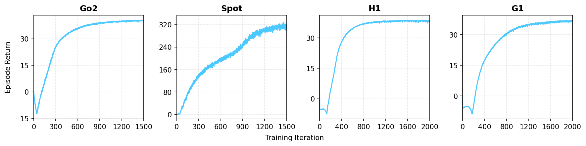
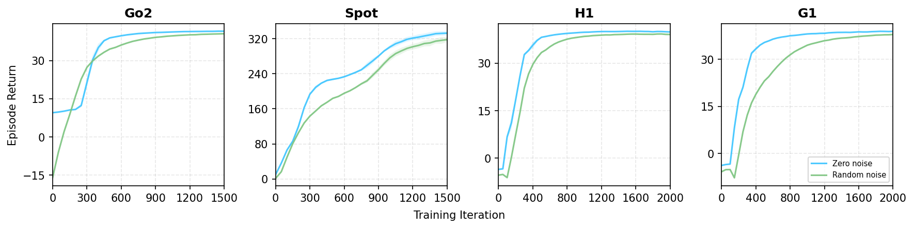
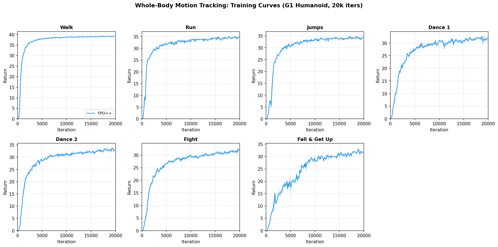

# FPO++ IsaacLab Experiments

FPO++ replaces Gaussian action distributions in PPO with a learned flow model
that maps noise to actions via an ODE. This repository integrates FPO++ as an
[NVIDIA Isaac Lab](https://isaac-sim.github.io/IsaacLab/) extension for
velocity-conditioned locomotion (6+ robots).

## Setup

**Prerequisites**: Linux, NVIDIA GPU with CUDA 12.1+.

```bash
# Install everything (conda env, IsaacSim 4.5, IsaacLab, isaaclab_fpo).
bash setup_env.sh

# Activate the environment (run this at the start of every session).
source source_env.sh
```

This creates a conda environment named `isaaclab_fpo`.

## Training

All FPO++ training is launched via `isaaclab_fpo/scripts/train.py`. Per-task hyperparameters are defined in `isaaclab_fpo/isaaclab_fpo/task_cfgs.py`.

### Velocity-Conditioned Locomotion

```bash
# Unitree Go2.
python isaaclab_fpo/scripts/train.py --task Isaac-Velocity-Flat-Unitree-Go2-v0 --headless

# Boston Dynamics Spot.
python isaaclab_fpo/scripts/train.py --task Isaac-Velocity-Flat-Spot-v0 --headless

# Unitree H1 (humanoid).
python isaaclab_fpo/scripts/train.py --task Isaac-Velocity-Flat-H1-v0 --headless

# Unitree G1 (humanoid).
python isaaclab_fpo/scripts/train.py --task Isaac-Velocity-Flat-G1-v0 --headless
```

**Expected training curves** (4096 envs):



| Robot | Iterations | Final Return |
|-------|-----------|--------------|
| Go2   | 1500      | ~40          |
| Spot  | 1500      | ~315         |
| H1    | 2000      | ~38          |
| G1    | 2000      | ~37          |

**Evaluation returns** (checkpoints evaluated with zero and random initial noise):



### Whole-Body Motion Tracking (G1)

```bash
# Train on a specific motion (default: walk1_subject1).
python isaaclab_fpo/scripts/train.py --task Tracking-Flat-G1-v0 --headless

# Train on a different motion.
python isaaclab_fpo/scripts/train.py --task Tracking-Flat-G1-v0 --headless \
    env.commands.motion.motion_file=whole_body_tracking_reference_data/dance1_subject2.npz
```

Available motions (in `whole_body_tracking_reference_data/`):
`walk1_subject1`, `run1_subject2`, `jumps1_subject1`, `dance1_subject1`,
`dance1_subject2`, `fight1_subject2`, `fallAndGetUp1_subject1`.

**Expected training curves** (4096 envs):



### Common Options

```bash
# Override num envs, max iterations, seed.
python isaaclab_fpo/scripts/train.py \
    --task Isaac-Velocity-Flat-Unitree-Go2-v0 --headless \
    --num_envs 4096 --max_iterations 2000 --seed 42

# Log to Weights & Biases.
python isaaclab_fpo/scripts/train.py \
    --task Isaac-Velocity-Flat-Unitree-Go2-v0 --headless \
    --logger wandb --log_project_name my-project --run_name trial_01

# Override hyperparameters via positional args (useful for sweeps).
python isaaclab_fpo/scripts/train.py \
    --task Isaac-Velocity-Flat-Unitree-Go2-v0 --headless \
    agent.algorithm.learning_rate=3e-4 \
    agent.algorithm.n_samples_per_action=32
```

| Flag                 | Description                                      |
| -------------------- | ------------------------------------------------ |
| `--logger wandb`     | Enable W&B logging (default: tensorboard)        |
| `--log_project_name` | W&B project name (default: `isaaclab`)           |
| `--run_name`         | Suffix appended to the timestamped run directory |
| `--num_envs`         | Number of parallel environments                  |
| `--max_iterations`   | Override max training iterations                 |
| `--seed`             | Random seed (`-1` for random)                    |

## Playback (Viser)

Visualize a trained policy in the browser using [Viser](https://viser.studio/):

```bash
# Load checkpoint from a local path.
python isaaclab_fpo/scripts/play_with_viser.py \
    --task Isaac-Velocity-Flat-Unitree-Go2-v0 \
    --checkpoint logs/isaaclab_fpo/unitree_go2_flat_flow/2025-01-01_00-00-00/model_1500.pt \
    --headless --viser --num_envs 1

# Load checkpoint from W&B (entity/project/run_id from the run's URL).
python isaaclab_fpo/scripts/play_with_viser.py \
    --task Isaac-Velocity-Flat-Unitree-Go2-v0 \
    --wandb-run-path my-entity/my-project/abc123xy \
    --wandb-checkpoint model_1500.pt \
    --headless --viser --num_envs 4

```

Then open `http://localhost:8080` in your browser.

The `--wandb-run-path` is the `entity/project/run_id` from your W&B run URL (e.g. `https://wandb.ai/my-entity/my-project/runs/abc123xy` → `my-entity/my-project/abc123xy`).

## Go2 sim2real（估计线速度 / 无线速度）

两条学生路径，都用 Sport 站立默认关节 + 同一套 DR。**不要用摇杆当线速度。**

| 思路 | gym task（训 / Play） | 演员观测 | 部署 `obs_mode` |
|------|----------------------|----------|-----------------|
| 估计线速度 | `Isaac-Velocity-Flat-Unitree-Go2-EstLinVel-v0` / `-Play-v0` | 48 维，前 3 维 = `LegOdom` | `estimator` |
| 完全不用线速度 | `Isaac-Velocity-Flat-Unitree-Go2-NoLinVel-v0` / `-Play-v0` | 45 维，丢掉 lin vel | `nolinvel` |

Critic 训练时仍看 GT 线速度（只给 value，不上实机）。老师是 FPO++ **baseline**（GT 线速度）；学生是 `all_ideas_teacher_kd`。

本机 overlay 容易满盘，训练 / Play 请带上：

```bash
export CONDA_ROOT=/root/miniconda3_isaaclab_fpo
source source_env.sh
export TORCHDYNAMO_DISABLE=1 TORCH_COMPILE_DISABLE=1
export TMPDIR=/workspace/plsy/.tmp/go2_play
```

### 训练

```bash
# 48-D 学生：老师 = DR baseline（GT lin vel），学生吃 LegOdom
GPU=1 NUM_ENVS=4096 bash scripts/run_go2_estlinvel_teacher_kd.sh

# 45-D stance baseline，然后 45→45 KD
GPU=0 NUM_ENVS=4096 bash scripts/run_go2_nolinvel_stance_baseline.sh
GPU=2 NUM_ENVS=8192 bash scripts/run_go2_nolinvel_stance_teacher_kd.sh
```

不要和正在跑的作业抢 GPU1 / GPU2。

### Viser 回放（关 DR 的 Play task）

资源目录用已有的 Go2 网格（新 task 名默认目录里往往没有 glb）：

```bash
# 48-D 估计线速度学生
CUDA_VISIBLE_DEVICES=0 python isaaclab_fpo/scripts/play_with_viser.py \
  --task Isaac-Velocity-Flat-Unitree-Go2-EstLinVel-Play-v0 \
  --fpo_variant all_ideas_teacher_kd \
  --checkpoint logs/isaaclab_fpo/go2_estlinvel_kd_from_dr_2500/2026-08-31_10-50-21_2026-08-31_10-49-38_all_ideas_teacher_kd/model_850.pt \
  --headless --viser --viser-port 8092 --num_envs 16 \
  --asset-dir isaaclab_fpo/viser_assets/isaac_velocity_flat_unitree_go2_v0

# 45-D 无线速度（stance baseline）
CUDA_VISIBLE_DEVICES=0 python isaaclab_fpo/scripts/play_with_viser.py \
  --task Isaac-Velocity-Flat-Unitree-Go2-NoLinVel-Play-v0 \
  --fpo_variant baseline \
  --checkpoint logs/isaaclab_fpo/go2_nolinvel_stance_baseline_2500/2026-08-31_10-25-07_2026-08-31_10-24-24_baseline/model_2499.pt \
  --headless --viser --viser-port 8093 --num_envs 16 \
  --asset-dir isaaclab_fpo/viser_assets/isaac_velocity_flat_unitree_go2_v0
```

### 导出 ONNX（flow 步数写进图里）

在 `go2_deploy/` 下导出。`sampling_steps` 会 bake 进 `policy.onnx`，改 YAML 不会改已导出的图。

当前 48-D 学生 ckpt：`model_850.pt`（训练未完时替换路径后再导一次）。

```bash
cd /workspace/plsy/go2_deploy
export CONDA_ROOT=/root/miniconda3_isaaclab_fpo
bash scripts/export_fpo_onnx.sh --model estlinvel_kd --steps 1  --out-name estlinvel_kd_s1
bash scripts/export_fpo_onnx.sh --model estlinvel_kd --steps 10 --out-name estlinvel_kd_s10
bash scripts/export_fpo_onnx.sh --model estlinvel_kd --steps 32 --out-name estlinvel_kd_s32
bash scripts/export_fpo_onnx.sh --model estlinvel_kd --steps 64 --out-name estlinvel_kd_s64
```

产物：

| 文件 | 含义 |
|------|------|
| `go2_deploy/exported/estlinvel_kd_s1/policy.onnx` | 1-step |
| `go2_deploy/exported/estlinvel_kd_s10/policy.onnx` | 10-step（同时拷到 `exported/estlinvel_kd/`） |
| `go2_deploy/exported/estlinvel_kd_s32/policy.onnx` | 32-step |
| `go2_deploy/exported/estlinvel_kd_s64/policy.onnx` | 64-step |

45 维：`--model nolinvel_stance`（或训完后的 `nolinvel_kd`）。

### 真机 / mock 部署

部署代码在仓库根目录的 `go2_deploy/`（不是本目录）。观测由 `--model` 决定：`estlinvel_kd_*` → 48 维 LegOdom；`nolinvel_*` → 45 维、观测里没有线速度。

```bash
cd /workspace/plsy/go2_deploy
source .venv/bin/activate   # 狗上用狗上的 venv

python -m go2_deploy --list-models

# mock 网页（不开 LowCmd）
python -m go2_deploy --mode fpo --model estlinvel_kd_s10 --host 0.0.0.0

# 真机：1 / 10 / 32 / 64 step 换模型名即可
python -m go2_deploy --mode fpo --model estlinvel_kd_s1  --fpo-hardware --host 0.0.0.0
python -m go2_deploy --mode fpo --model estlinvel_kd_s10 --fpo-hardware --host 0.0.0.0
python -m go2_deploy --mode fpo --model estlinvel_kd_s32 --fpo-hardware --host 0.0.0.0
python -m go2_deploy --mode fpo --model estlinvel_kd_s64 --fpo-hardware --host 0.0.0.0

# 45-D 无线速度
python -m go2_deploy --mode fpo --model nolinvel_stance --fpo-hardware --host 0.0.0.0
```

浏览器 `http://<IP>:8080`。网页勾选「启用模型」后再推杆。`action_clip` 必须是 **2.0**，`obs_scale_*` 全是 **1.0**。不要设 `lin_vel_mode: cmd`。

硬轨迹验收、接管顺序见 `go2_deploy/docs/DEBUG_WORKFLOW.md`。

## Directory Layout

```
isaaclab_experiments/
├── isaaclab_fpo/                         # FPO++ package (algorithm + IsaacLab integration)
│   ├── scripts/
│   │   ├── train.py                     # Main training entry point
│   │   ├── play_with_viser.py           # Viser-based policy playback (browser)
│   │   ├── play.py                      # IsaacSim viewer playback
│   │   ├── play_plot.py                 # Playback with live reward plotting
│   ├── viser_assets/                    # Pre-extracted robot meshes for Viser
│   └── isaaclab_fpo/
│       ├── task_cfgs.py                 # Per-task FPO++ hyperparameters (TASK_CONFIGS registry)
│       ├── rl_cfg.py                    # FPO++ config dataclasses
│       ├── algorithms/fpo.py            # FPO++ algorithm (flow-based PPO)
│       ├── modules/actor_critic.py      # Flow actor + value critic networks
│       ├── runners/on_policy_runner.py  # Training loop with EMA, eval, multi-GPU
│       ├── storage/rollout_storage.py   # Rollout buffer with CFM loss storage
│       ├── wrapper.py                   # VecEnv wrapper for IsaacLab
│       ├── cli_args.py                  # CLI argument helpers
│       └── patches.py                   # IsaacLab monkey-patches for sweep support
│
├── thirdparty/
│   ├── IsaacLab/                        # NVIDIA Isaac Lab (git submodule)
│   │   └── source/
│   │       ├── isaaclab/                # Core framework
│   │       ├── isaaclab_tasks/          # Task definitions (locomotion, etc.)
│   │       └── isaaclab_assets/         # Robot USD assets & configs
│   └── whole_body_tracking/             # Motion tracking envs (git submodule)
│
├── whole_body_tracking_reference_data/   # LAFAN1 motion NPZ files (generated by setup)
├── expected_training_curves_locomotion.png
├── expected_eval_curves_locomotion.png
├── expected_training_curves_tracking.png
├── expected_eval_curves_tracking.png
├── setup_env.sh                          # One-time environment setup
└── source_env.sh                         # Activate conda env
```

## Acknowledgements

The `isaaclab_fpo` package combines and adapts code from the following projects:

| Source | License | What we adapted |
|--------|---------|-----------------|
| [rsl_rl](https://github.com/leggedrobotics/rsl_rl) (ETH Zurich + NVIDIA) | BSD-3-Clause | Actor-critic, on-policy runner, rollout storage, normalizer, logging utilities |
| [IsaacLab](https://github.com/isaac-sim/IsaacLab) (NVIDIA) | BSD-3-Clause | VecEnv wrapper, config dataclasses, training/play/evaluate scripts, ONNX exporter |

`IsaacLab/` is included as a git submodule under its original license. The `isaaclab_fpo` package adapts code from rsl_rl and IsaacLab; original copyright headers are retained in all adapted files.
